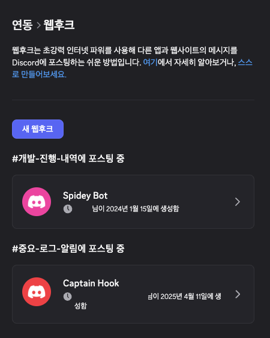
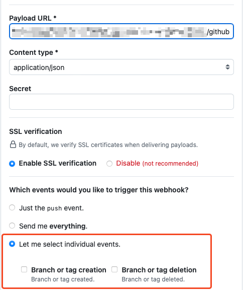
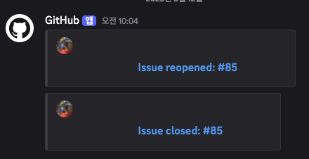

디스코드 웹훅을 깃허브에 연동하여, 깃허브의 업데이트를 디스코드에서 받아보는 방법을 알아봅시다.
사실 `서버 설정->앱->연동->웹후크`에서 디스코드 웹훅을 생성할 수는 있습니다.

그리고 보통 웹훅은 깃헙 레포지토리의 `Settings->Code and automation->Webhooks`에서 설정합니다.

`Add webhook`으로 아래처럼 웹훅을 추가할 수 있습니다. `Payload URL` 부분에 디스코드 쪽 웹후크 주소를, `Content type`은 `application/json`으로 설정합니다.

하지만 깃헙의 디스코드 메시지는 format에 맞게 웹푹을 호출하지 않기 때문에 난감한 상황이 발생합니다. 직접 메시지버전 body를 생성해야 하는지의 고민을 하게 됩니다.

제일 간단한 해결 방법은, 디스코드 웹훅 뒤에 `/github`을 붙여주는 것입니다. 그러면 깃헙에서 보내는 메시지 포맷을 디스코드가 알아서 변환해줍니다. 아래처럼 `Payload URL`을 설정합니다.
저의 경우엔 모든 이벤트를 다 받을 생각은 없어, `Let me select individual events`를 체크하고, 몇몇 이벤트를 선택하였습니다.

이제 아래처럼 채널에 메시지가 올라옵니다.

