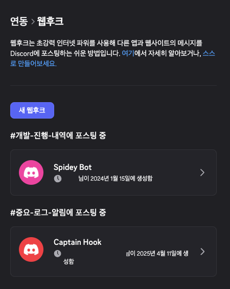
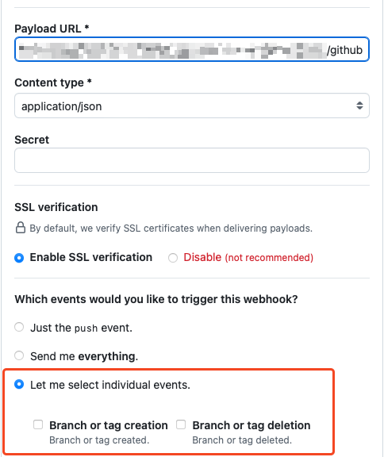
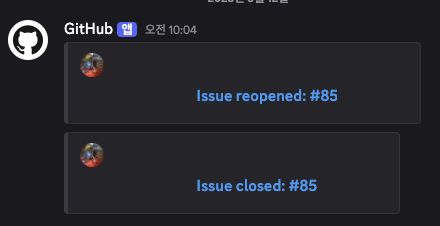

디스코드 웹훅을 깃허브에 연동하여, 깃허브의 업데이트를 디스코드에서 받아보는 방법을 알아봅시다.
우선 웹훅은 디스코드에서 `서버 설정`->`앱`->`연동`->`웹후크`로 접근해 생성할 수 있습니다.

그리고 깃헙 레포지토리에서 `Settings`->`Code and automation`->`Webhooks`->`Add webhook` 페이지를 열어봅니다. 특정 주소로 이벤트를 전송할 수 있게끔 되어 있습니다.

`Payload URL` 부분에 디스코드 쪽 웹후크 주소를, `Content type`은 `application/json`으로 설정합니다.

하지만 이대로 웹훅을 설정하면 디스코드에선 아무런 변화도 일어나지 않습니다. 웹훅으로 전달되는 페이로드는 디스코드 API 규약과 달라 메시지를 발송하지 않기 때문입니다. 이렇게 되면 중간 경유 API를 만들어 주어야 하는지 고민을 하게 됩니다.

제일 간단한 해결 방법은, 디스코드 웹훅 뒤에 `/github`을 붙여주는 것입니다. 그러면 깃헙에서 보내는 메시지 포맷을 디스코드가 알아서 변환해주는 것으로 보입니다. github 뿐만 아니라 다른 옵션도 있을 것으로 생각되네요.

본론으로 돌아와서, 깃헙 설정 페이지에서 아래처럼 `Payload URL`을 설정합니다.
저의 경우엔 모든 이벤트를 다 받을 생각은 없습니다. 따라서 `Let me select individual events`를 체크하고, 필요한 몇몇 이벤트를 선택하였습니다.

이제 웹훅 이벤트가 트리거 될 때마다 아래처럼 채널에 메시지가 올라옵니다.

깃허브에서 발생하는 이벤트를 디스코드에서 받아볼 수 있게 되었습니다.
