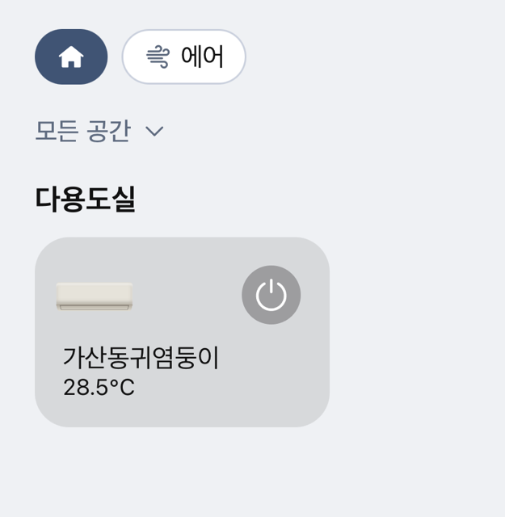
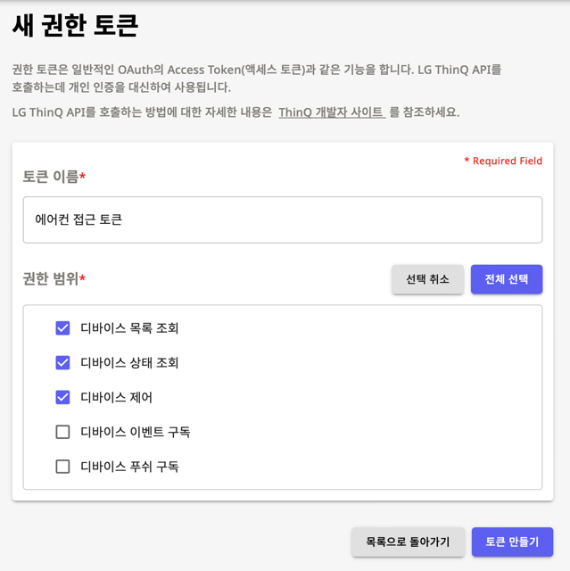
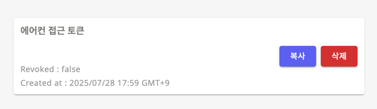
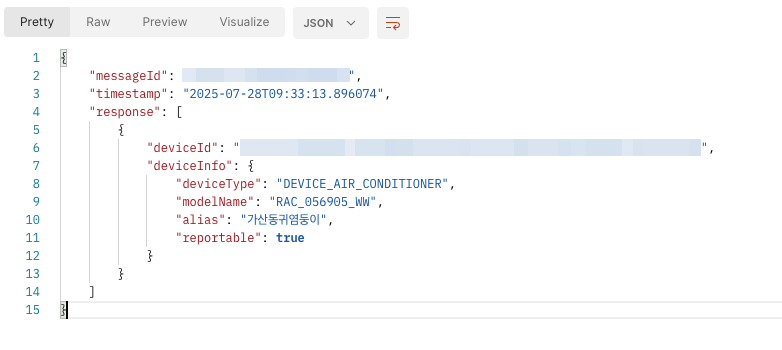
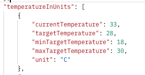
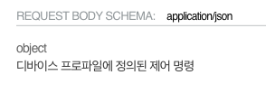
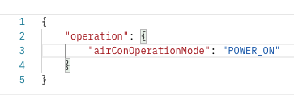
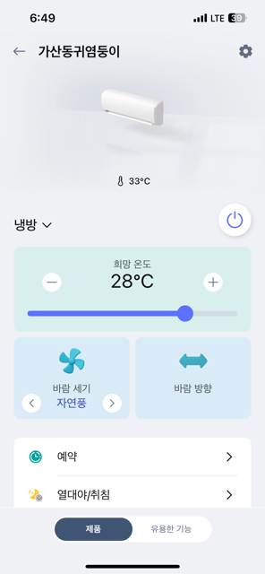
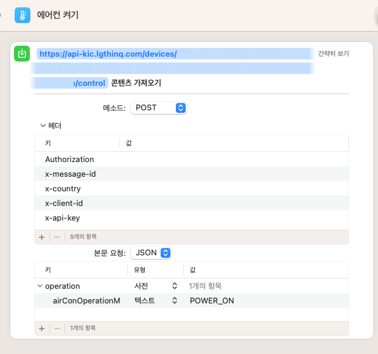
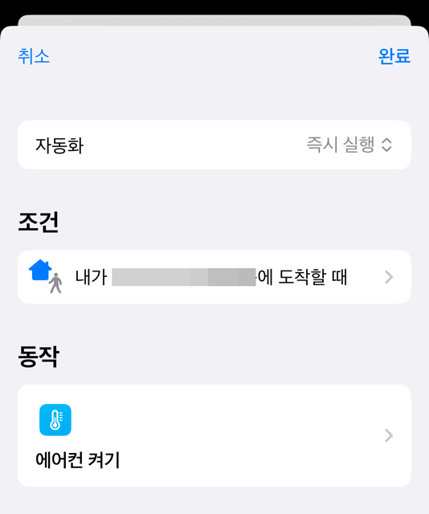

최근 관리실에서 에어컨을 교체해주셨습니다. 여태 정속형 에어컨을 쓰고 있었다보니 전기세가 많이 나와 진짜 죽을 것 같은 순간 외에는 거의 틀지 않았는데요, 인버터형으로 교체해주시면서 전기세가 대폭 줄어들 것 같습니다. 일단 새 에어컨이라 기분이 좋아요.

<!-- 이미지 크기 300px로 지정 -->

나름 외부에서 기기를 직접 제어하는 것이 가능하도록 앱을 제공하고 있습니다. 자체적으로 자동화 기능을 제공하지만 자원을 많이 먹거나 동작이 잘 되지 않고, iOS에서 기본적으로 제공하는 기능과 seamless하게 연동되진 않더라구요. 어쨌든 에어컨을 제어하는 단축어를 추가해두면 유용하겠다는 생각이 들었습니다.

초기화 시에 나름 네트워크 연결 과정이 있기도 하거니와, 앱을 통해 외부에서 연결이 가능하다는 것은 아마 내부적으로 API 통신을 하고 있겠다는 생각이 들었고, 이것저것 자료를 찾아보니 개발자센터에 관련 API들이 공개되어 있었습니다.

## LG ThinQ API

[LG에서 제공하는 랜딩 페이지](https://smartsolution.developer.lge.com/ko/cloud/landing)

우선 API를 사용하기 위해서는 [여기](https://connect-pat.lgthinq.com)에서 PAT를 발급받아야 합니다.

묘하게 UI가 익숙한데 왜 익숙한지 모르겠네요. 옛날에 써봤던 Vuetify랑 닮은거같기도하고?
발급받은 PAT는 API를 호출할 때 Authorization 헤더에 Bearer 토큰으로 넣어주면 됩니다.

## API 호출

특정 기기에 접근하기 위해서는 먼저 기기 목록을 조회해야 합니다. 가이드 문서를 따라, 기기 목록 API를 조회해보겠습니다.

벌써 반쯤 된 것 같은 기분이 듭니다. 기쁘네요.
여기서 나오는 device id를 이용해 디바이스 프로파일과 상태를 조회합니다. 굉장히 구구절절 많은 데이터가 응답값으로 오는데요, 제어가 가능한 요소, 불가능한 요소, 읽기 전용 데이터 등등을 표시하는 내용이 포함되어 있는 것 같습니다.

상태값을 조회해보니, 현재 집 내부 온도와 제가 마지막으로 설정한 목표 온도가 있습니다.

디바이스를 제어하려면, 프로파일에 정의된 제어 명령을 사용해야 한다고 기재가 되어 있네요.
프로파일의 response를 참고해서, 한번 전원을 켜보겠습니다.

에어컨이 켜졌습니다. 기분이 좋네요.
이걸 이제 단축어로 등록해보겠습니다.

## 마무리

단축어 앱을 켜서, 새 단축어를 생성해줍니다. POST 요청을 발송하는 기능이 있어서, 이 기능을 사용해보겠습니다.

단축어를 실행하면 에어컨이 켜지는 것을 확인했습니다. 인버터형은 껐다켰다 하는 게 더 전기가 많이 든다던데, 벌써 세번은 껐다 켰습니다. 안타까운 일이 아닐 수 없네요..

애플 단축어를 통해 자동화 하는 것이 가능해졌습니다.
우선은 집 반경 5분거리 쯤에 도달하면 자동으로 에어컨을 켜도록 설정해 두었습니다.
이제 집에 들어가면 에어컨이 켜져있을 것 같네요.
