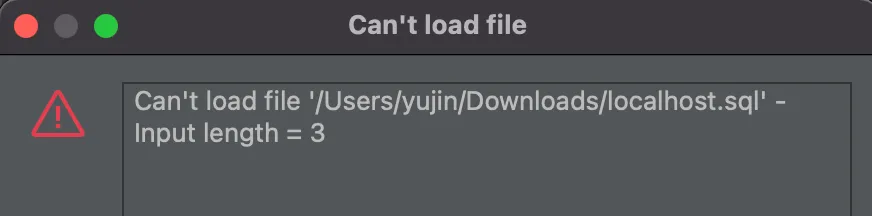
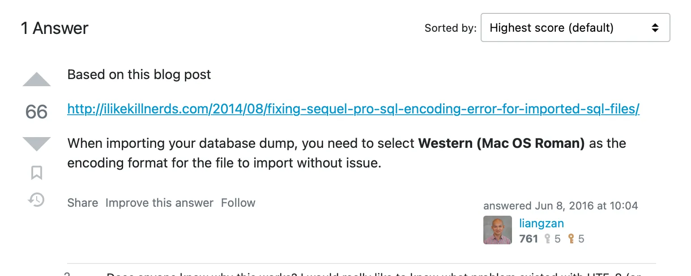

정말 각종 자잘한 문제가 터져서 지금도 딱히 안정적이지 않지만, 기억해둘만한 일들을 메모합니다.

## 서비스에 대한 개요

우리 서비스 중 하나는 내 기억이 틀리지 않았다면 2017년 혹은 2018년 부터인가 (아마 2018년일듯) PHP기반의 `Xpress Engine`으로 돌아가고 있다.

왜 해당 프레임워크를 사용했느냐면, 당시에 보편적으로 웹사이트를 만들 때 두루두루 쓰였고 나는 웹에 대한 지식이 거의 없었으며 운영을 맡은 이가 조금 더 익숙한 엔진을 쓰기로 했기 때문이다.

서버는 그 시절에 D모 호스팅(이하 ◼︎◼︎으로 검열)이 싸다고 하여 쓰게 되었던 걸로 기억한다. 기존 ◼︎◼︎의 임대 서버에서는 기설치된 환경 내에서 php, html, css 등의 파일만 교체하는 식의 작업만 가능했다. 가끔 DB 테이블을 조작해야 할 때에는 `phpmyadmin`에서 냅다 SQL 쿼리를 던졌다. 코어한 조작은 사실상 불가능했다.

그러나 2018년부터 운영된 서버는 슬슬 연장할 때마다 금전적 비용 압박이 커졌다. ◼︎◼︎에 묶여 있는 것이 편하긴 하지만 자유도가 낮고 서비스가 종속되며, 가성비가 떨어진다고 느꼈다. HTTPS가 유료인 것도 불만이었다.

그럼에도 불구하고 이렇게 ◼︎◼︎을 장기로 이용하게 된 이유는 딱 하나였다. 2018~2019년 사이 그 언젠가 원인불명의 트래픽 _—사이 안좋던 "친구들"과 싸웠던 시기였으므로 디도스로 추정된다 ~~그래서 나도 HTTP Cache Clear 공격 스크립트를 짜서 심심할 때마다 돌렸다. 진지하게 고소당할 것 같아서 멈췄다. 미안하다~~—_ 으로 인해 사이트가 자꾸 다운되었고, 복구시점이 되어도 죽어있는 현상이 발생하였다.

◼︎◼︎의 CS 담당자는 우리의 문의가 귀찮았는지 트래픽 용량을 한동안 **10배**로 올리는 것으로 조치를 완료해버렸다(일 3G→**30G**). 고의인지 실수인지 알 길은 없으나, 담당자가 원상 복구하는 것을 까먹어버린 것인지 30기가인 채로 n년간 유지되었다. 그리고 이것이 해당 호스팅사의 이름을 ◼︎◼︎로 검열한 이유이다. 어쨌든 우리는 졸지에 소달구지에서 람보르기니를 타게 되었다.

우리도 같은 가격에 10배나 높여줬으면 “그냥 쓰지 뭐” 상태가 되어 그냥저냥 조금 비싸더라도 일 3G 호스팅의 비용을 2년 단위로 내고 사용하고 있었다. **사이트 사용자가 크게 줄어들기 전까지는…**

## 마이그레이션을 하게 된 이유

2022년 초, 연장 시점이 다시 다가오니 선택의 기로에 섰다. 좀 비싸더라도 일일 3G 트래픽(실제로는 30G인)의 서버를 쭉 이용할 것인지, 다른 방법을 모색할 것인지. 나는 서비스를 내릴 게 아니라면 차라리 홈 서버나 무료 클라우드를 이용하는 방향으로 가자고 의견을 냈다.

다만 인터넷이 이미 깔려있는 다세대 특성 상 내맘대로 홈서버 환경을 만들 수 없고(공유기 설정이 필요), 이사를 생각하고 있었던 터라 이사 전/중/후에 무슨 장애가 터질지 상상조차 안 됐기에, 당시 무료 클라우드로 알려진 Oracle Cloud Infrastructure, 통칭 오라클 클라우드를 이용하기로 했다. 오라클 클라우드를 사용해본 적은 없으나, 어쨌든 내가 책임지고 옮기겠다고 했다. 결과적으로 1년이 넘게 걸렸지만 말이다. 매우 미안합니다..

## 옮기기 시작

따라서 클라우드도 docker도 익숙하지 않은 내 기적의 능력치를 고려해, 최대한 ◼︎◼︎의 환경과 비슷하게 맞추어 그대로 옮길 생각이었다.

그러나 다음과 같은 문제들이 발생했다. 거의 대부분의 문제는 ◼︎◼︎ 서버 자체가 너무 옛날 환경이었고, 이걸 최신 서버에서 재현할 수가 없어서 발생하는 것이었다.

## 서버에 직접 환경을 구축했을 때의 발생 이슈들

- 신규버전 PHP깔고 디비 깔고 빠르게 스크립트 파일들부터 옮겼으나, 기존 ◼︎◼︎에서 사용했던 XE 버전이 PHP 구버전 용이었기에 아예 호환이 안 되었다. 버전 문제로 사이트에서 PHP 버전이 다르다는 오류를 뱉어버렸다. 당시에 얼마나 배경지식이 없었는지 보여주는 부분이다.
- 여기서부터 다운그레이드의 늪에 빠지게 되었다. 기존 ◼︎◼︎에서 사용중인 PHP 버전이 너무 옛날 버전이라, apt로 설치가 되지 않았다. 오래되어서 공식적으로 없어져버린 버전이었음.
- 이걸 해결하기 위해 각종 눈물의 코딩쑈를 시전하였다. `ondrej`라는 유저의 구세대 백업 버전을 이용했다. 그리고 이번엔 DB와 연결이 되지 않았다. 마찬가지로 PHP버전이 너무 낮아서 발생한 일. 따라서 DB 버전도 강제로 낮추게 되었다.
- DB 관리툴 `phpmyadmin`까지 오류를 뱉어내기 시작함. → 마찬가지로 … (생략) … 다시 반복
- 구버전들이 대체로 서드파티에서 야매로 구현한 게 많아서인지 자기들끼리 꼬이고 뭐가 자꾸 안되니 이쯤되면 현타가 오기 시작. 포기상태

## 방향 변경

여기서 설상가상으로, 오라클의 불안정한 서버 환경으로 인해 `authorized_keys`의 내용이 날아갔는지 서버 접근 권한까지 터지면서 내 멘탈도 같이 공중분해되어버림. 서버 인스턴스가 통째로 미아가 되어 들어갈 방법이 없었다. 인터넷에 떠돌아다니던 웹 콘솔 접근하는 방법도 먹히지 않았다. 오라클은 사용자가 적은지 국내외 참고할 게시글조차 없었다.

결국 새 마음으로 다시 서버를 파면서 ARM 기반의 넉넉한 용량 서버를 만들었다. _그러나 이 때는 몰랐다…이게 원인이었던 문제도 발생함_ 그리고 서버에 종속되지 않도록, 혹여 다시 서버 접근 권한이 터져도 바로 다시 올릴 수 있게끔 `docker`로 전환하기로 했다.

운 좋게도, 우리쪽 서버만큼이나 php 구버전으로 회사 업무를 하셨던 동료분의 도움으로 `docker compose`까지 완료된 보일러 플레이트 샘플을 받았다. `php 5.6` 기반의, `XE 1.11`(내가 쓰던 버전보다도 옛날 버전)이었기에 잘 이전할 수 있었다. 감사합니다 감사합니다 감사합니다…

그리고 회사에서 마침 안면있던 팀의 팀장님께서 `docker` 강의를 진행해주셨다. 질문 타임에서 필요한 부분을 거의 다 여쭤보았는데, 비록 원하는 답을 듣지는 못 했지만 이 때 실 서비스에서 구축된 코드를 보게 되어 이 부분에 대한 참고도 많이 하였다.

나는 동료분이 작성하신 보일러 플레이트를 기준으로, 기존 서버 이전 작업을 시작했다. 소스코드를 옮기고, 그 외 필요한 서버 세팅, 디비 이전 작업, 디비 관리툴 추가 등등.

### 최초 Docker compose 구성

- ubuntu 20 + nginx + php 5.6 서버
- MariaDB 10.5

### 추가한 부분

- http(80) → https(443) 리디렉션
- SSL certificate 옵션 추가
- SSL 인증서 폴더 볼륨 바인딩
- DB 마이그레이션
- php 파일(XE) 이전
- phpmyadmin 4.9

## 새로운 이슈 상황 발생

|                          | **운영체제** | **아키텍처** |
| ------------------------ | ------------ | ------------ |
| **내 컴퓨터**            | Mac OS       | ARM64        |
| **구 ◼︎◼︎ 호스팅**       | ?????        | x86_84(추정) |
| **구 오라클 인스턴스**   | Ubuntu       | AMD64        |
| **신규 오라클 인스턴스** | Ubuntu       | ARM64        |

인스턴스의 아키텍처가 `amd→arm`으로 변경되었고, 맥북과 동일하니 내 컴퓨터에서 돌아가면 서버에서도 돌아갈 거라는 가정을 하고 작업했다._(물론 착각이었음!)_

### SQL import 불가 이슈

DB 백업 덤프 파일이 250MB 정도인데, 이게 로컬에서 불러오기가 안 되었음.

\*\* 장난하냐

혹시 한국어가 깨지는 등의 문제라면 클라이언트 프로그램 문제인가 싶어서 DBeaver 말고 다른 프로그램까지 설치해서 연결했으나 동일한 문제 발생 확인. 많은 검색 후 스택오버플로우의 어느 대현자가 맥 문제라고 적어놓은 것을 발견했다.

파일 인코딩을 `UTF-8`로 하지 않고, `Western (Mac OS Roman)`으로 불러오니 정상적으로 쿼리를 불러와 실행하는 것 확인했다. 한글도 깨지지 않는다. 맥 이슈는 며느리도 모른다.

### 서버 아키텍처로 인한 빌드 이슈

로컬에서 웹 서버 멀쩡히 돌아가는 것 확인했고, 소스코드 정상 이전도 확인했고, DB 정상 연결 되는 것도 확인했고, 기존 DB 백업본 이전 잘 된 것도 확인했다. 물론 실행할 때에 뭔가 아키텍처 플랫폼 이슈 경고가 뜨긴 했는데, 멀쩡하게 동작했기 때문에 유념하지 않았다. 그대로 서버에 올려 `docker compose up`만 하면 되는 상황이었다.

`scp`로 대충 옮겨서 컨테이너 빌드 및 업을 시작했다. 그런데 브라우저에서 열어보니 XE단에서 DB 연결이 안 된다는 오류가 발생하고 있었음. 내부 문제인지 외부 문제(가상 네트워크 쪽 설정 문제 등)인지 파악이 필요했다. 그래서 내렸다가 올렸다가 청기백기쑈를 하고 있었으나 애초에 3개여야 할 컨테이너가 웹서버 하나만 덩그러니 올라가있다는걸 확인했다.

“내 로컬도 `arm64`인데 왜 서버에선 빌드가 안 된 거지?”라고 생각하던 찰나 깨달아버렸다. 내가 올리는 것들이 전부 워낙 구버전이다보니 애초에 처음부터 `arm64` 빌드를 제공하지 않았고, arm 맥은 아직 대중적이지 않은 arm의 호환성을 우려한 팀쿡님이 보우하사 Rosetta를 통한 `x86` 호환이 되는 구조다. 즉, 로컬에서 처음부터 arm버전 다운로드를 시도했지만 실패해서 경고를 띄웠고, x86버전을 억지로 돌리고 있던 거였음.

그래서 서드파티의 늪을 지나 결국 또 모르는 정체불명 누군가가 도커에 올려놓은지 8개월은 지난 `arm64v8` 호환 버전 마리아DB와 phpmyadmin을 꾸역꾸역 찾아내어 설치했고 모든게 잘 동작함을 확인할 수 있었다.

# 마무리

SSL도 큰 이슈 없이 잘 되고, 웹앱도 잘 돌아가고, 일단은 이전이 된 것 같다.

다만 과거 웹에 대한 지식이 전무하던 내가 억지로 구현해놓은 코드들을 보니(정말 아는 게 없는 상태였을텐데 플러그인, 모듈 등 정말 많이도 만들어놨다…), 하드코딩된 게 정말 많았다. 이제 데이터베이스 상에서 하드코딩된 모든 … 주소를 바꿔야 하는 상황이다.

## 그 외 바꿔야 하는 것들

- 이미지 업로드 플러그인 수정, imgur API 이전(해야하나? 일단 상관없이 동작하는 것 같긴 하다)
- 푸시 구현 당시 사용한 FCM 이전.
- FCM 사용을 위해 안드로이드 마켓에 올린 앱은 이제 빠이…
- 그리고 디버깅은 계속된다
