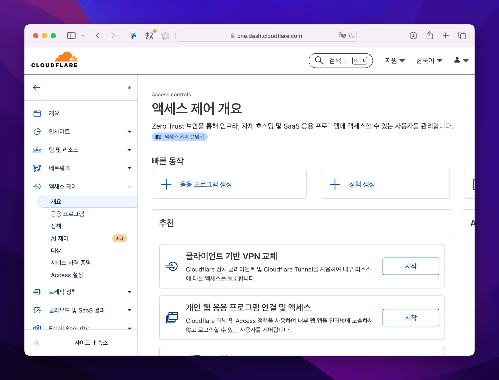
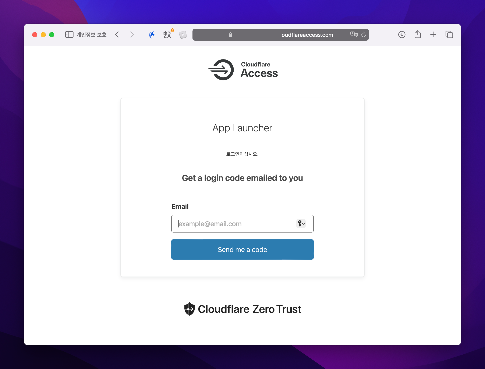
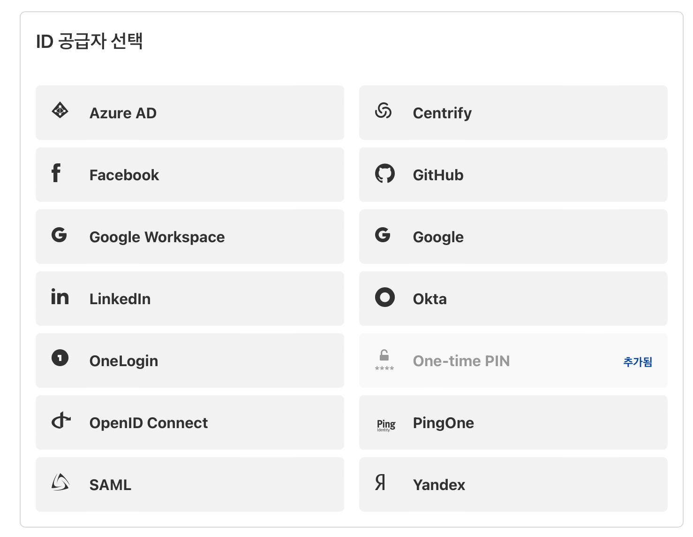
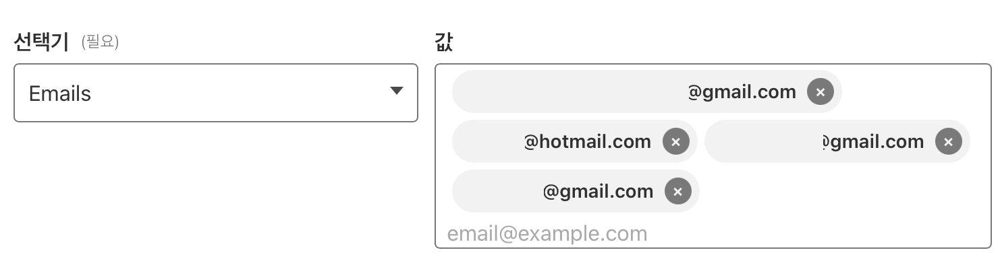
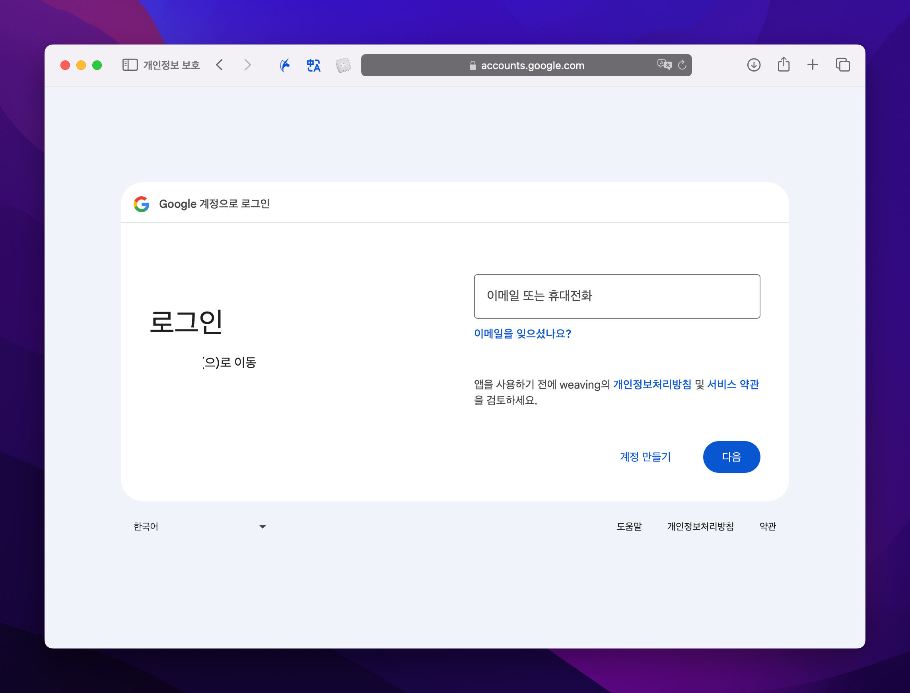
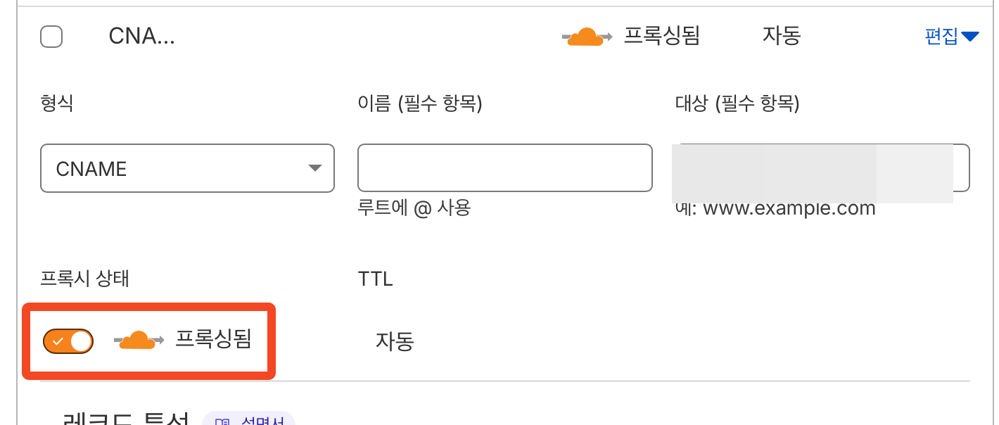
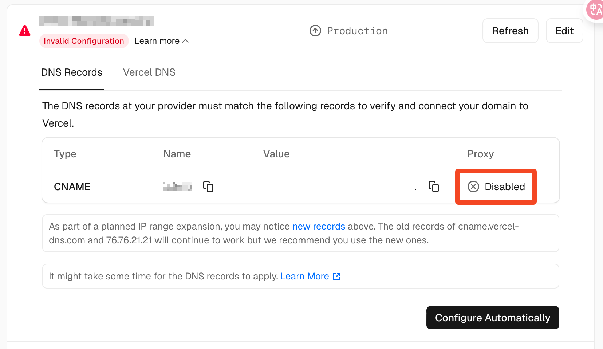
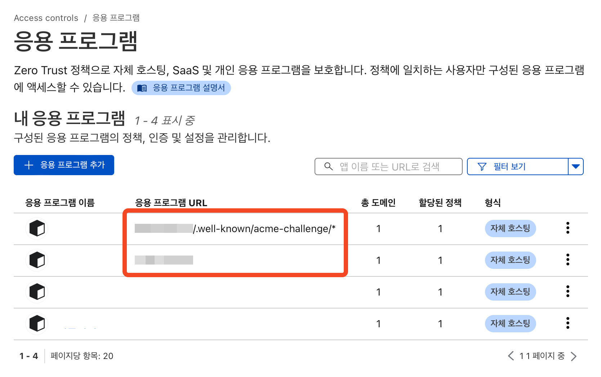
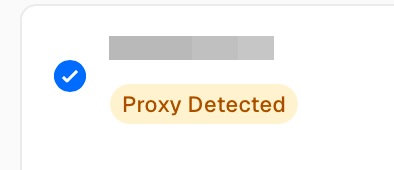

## 개요

클라우드플레어의 Zero trust는 액세스 제어 기능을 제공합니다.
굳이 복잡한 인증 인가 구현 없이 클라우드플레어가 제공하는 접근 제한 정책을 이용할 수 있습니다.
설정하는 방법은 간단하기 때문에 생략하겠습니다.

### 이걸 어디에 쓰면 좋을까?

- 개발 환경, 쉘 등 접근 제어
- 백오피스 접근 제어
- 내부 배포 페이지 접근 제어
- etc...

활용처는 무궁무진합니다. 저는 위에 예시로 든 케이스들을 전부 사용하고 있습니다. 직접 어설프게 접근 제어를 구현하는 것보다 클라우드플레어의 기능을 이용하는 것이 훨씬 현명할 수 있기 때문에 적극적으로 쓰고 있습니다. 인증인가를 구현하기 위해 들어가는 시간, 비용에 비해 크게 메리트가 없다면 위임하는 게 좋겠죠.

### 접근은 어떻게?

액세스 정책이 설정된 도메인에 접근하면 위와 같이 cloudflare access 페이지가 뜹니다.

로그인 프로바이더도 꽤 다양하게 제공하는데, 저는 주로 구글 로그인을 사용합니다. 어차피 내부에서 사용한다면 유저가 많지 않기 때문에 과금될 일은 딱히 없어보입니다.

ID 프로바이더를 구글로 연결하고, 기본적인 정책을 기재합니다. 저의 경우 구글로 로그인했거나 one-time PIN을 요청한 이메일 주소를 체크하도록 했습니다. 제가 화이트리스트에 넣어둔 메일 주소라면 통과시켜주는 것이죠.

첫 페이지를 스킵하는 옵션을 활성화하면 제가 지정한 도메인으로 접근 시 바로 구글 로그인 화면이 표시됩니다. 로그인이 성공하면 정책에서 설정한 시간동안 접속 세션이 유지됩니다.

단순히 메일만 체크하는 것이 아니라, 인증서를 확인하거나 정해진 토큰이 있다거나 WARP연결이 되어 있어야 하는 등등 조금 더 튼튼한 설정도 가능합니다.

여기까지가 기본적인 클라우드플레어 제로 트러스트 액세스 ,,, 의 기능 설명입니다.

## 이슈 발발

이게 서브도메인에서 발생하는 문제인지, 단순히 액세스와 연결하면서 생겨난 문제인지 확실하지가 않습니다만🫠

설정이 제대로 이루어지지 않았을 때 제가 겪은 문제들은 이렇습니다.

### 클라우드플레어 액세스 페이지 자체를 스킵하는 경우

사실 이 상황이 가장 치명적이라고 할 수 있겠네요,,
버셀에서 서브도메인에 해당하는 도메인을 등록하면 클라우드플레어를 통해
CNAME 필드를 추가합니다. 이 때 프록시가 켜지지 않은 상태로 추가가 되는데요,
이렇게 되면 **클라우드플레어의 접근 정책을 통하지 않기 때문에 그냥 스루하게 됩니다.**

그래서, 위와 같이 클라우드 플레어 DNS 설정 페이지에서 직접 프록시를 켜주어야 합니다.

여기서 깔끔하게 해결이 되면 좋겠지만...

### 버셀에서 오류가 나는 경우

이번에는 도메인 설정이 올바르지 않다는 오류가 발생합니다.
버셀에서 자동으로 추가해준 설정에서 프록시가 꺼져있는 것은 이유가 있었던 것입니다.
도메인 확인 시도를 하지만, 그 주소는 이미 설정한 바와 같이 비공개 상태이기 때문에(!) 버셀 쪽에서 연결이 안 되는 문제입니다.

그런데, 저 상태로도 사용에는 지장이 없습니다. 제가 사용해본 바로는 그렇습니다.
버셀에서 도메인 설정 똑바로 하라고 메일이 자주 오긴 하지만 정상적으로 페이지가 보호되고, 정상적으로 배포도 됩니다.

하지만 아무래도 빨간색 인디케이터를 보면 불안해지는 것이 사람의 심리입니다.
이것을 해결하기 위해 갖은 삽질을 했는데요, 좀 더 안전한 여러가지 방법이 있겠지만 가장 간단하게 해결하는 법을 적겠습니다.

기존에 접근 제한을 설정한 주소와 별개로, 인증서 연결을 위한 주소를 하나 더 생성합니다.
만약에 보호하고자 하는 서브도메인이 `example.yourdomain.com`이라고 치면, `example.yourdomain.com/.well-known/acme-challenge/*`경로까지 포함한 버전을 하나 더 추가합니다.
이 때 정책은 `BYPASS`로 설정이 되어 있어야 합니다. 저는 일단 `Everyone`으로 허용해놨습니다.

설정 후 갱신을 해보면 잠시 뒤 오류가 사라지고, 프록시가 확인되었다는 문구가 추가됩니다.
이제 이슈가 해결됐습니다.

## 마무리

약간의 우여곡절이 있긴 했지만, 저는 다방면으로 계속 사용할 것 같습니다.

접근하기가 편하기도 하고, 굳이 한두명 보는 백오피스를 위해 백엔드를 추가로 구축할 필요는 없으니까 말입니다 :p
