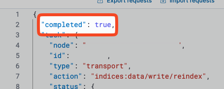


본 글의 일부 또는 전체를 다른 곳에 재게시하는 경우 출처를 명기해주시기 바랍니다.<br>
글의 내용은 그때그때 계속 추가될 예정입니다.


## 인덱스와 인덱스 템플릿

### 인덱스 템플릿에 이상이 있는지 테스트하고 싶을 때

템플릿의 문법 등이 올바른지 확인하고 싶을 때는 아래의 API를 사용하여 시뮬레이션할 수 있습니다.

```json
POST /_index_template/_simulate
{
	// 인덱스 템플릿 내용...
}
```

### Kibana 내에서 리인덱싱이 필요할 때

인덱스 템플릿 등이 변경되었을 때 웬만해서는 색인 과정을 처음부터 다시 수행하는 것이 좋겠으나, 자잘한 템플릿 설정을 변경한 경우에는 reindex만으로도 충분할 수 있습니다.

문서 수가 많다면 가급적 `wait_for_completion` 파라미터를 `false`로 지정하여 백그라운드에서 실행합니다.

```json
POST /_reindex?wait_for_completion=false
{
	"source": {
		"index": "original_index"
	},
	"dest": {
		"index": "new_index"
	}
}
```

위의 쿼리를 실행하면 백그라운드에서 수행하는 task id가 반환됩니다. 해당 task id를 통해 진행 상황을 확인할 수 있습니다.

```json
// 리인덱싱 태스크 완료 확인
GET /_tasks/[task_id]
```


주기적으로 완료 여부를 체크합니다. 완료 시 `completed` 필드가 `true`로 변경됩니다.
보통은 인덱스에는 추가 식별값을 넣고, `alias`를 설정하여 사용하실 텐데요. 이 때 `alias`도 롤링이 필요합니다.

```json
// alias 롤링
POST /_aliases
{
	"actions": [
		{ "remove": { "alias": "alias_name", "index": "original_index" }},
		{ "add": { "alias": "alias_name", "index": "new_index" }}
	]
}
```

기존 별칭을 제거하고 새로운 인덱스에 대한 별칭을 추가합니다.

## 검색 쿼리

### 검색 또는 집계 결과가 전체 문서를 대상으로 하지 않고 부분적으로만 나오는 경우

검색 엔드포인트에 쿼리 파라미터 `?track_total_hits=true`를 추가합니다.

### object의 배열이 담긴 nested 필드에 값이 존재하는지 확인하고 싶을 때

nested 쿼리를 사용하여 내부 필드를 검색할 수 있습니다.

```JSON
GET /[index_name]/_search
{
  "query": {
    "nested": {
      "path": "nested_field",
      "query": {
        "exists": {
          "field": "nested_field"
        }
      }
    }
  }
}
```

### Terms aggregation 시 유의

Terms aggregation을 사용할 때는 `size` 파라미터를 적절히 설정해야 합니다. 기본값은 10이기 때문에, 반환되는 bucket의 수가 10개로 제한됩니다. 따라서 unique한 term이 너무 많다면 composite aggregation을 사용해야 합니다.

## 분석기

### `analyzer`, `tokenizer`, `filter`, `char_filter`에 대한 간략한 설명

- `analyzer`: 텍스트를 색인하기 전에 분석하는 데 사용되는 구성 요소입니다. 일반적으로 텍스트를 토큰화하고, 소문자 변환, 불용어 제거 등의 작업을 수행합니다.
- `tokenizer`: 텍스트를 토큰으로 분할하는 역할을 합니다. 예를 들어, 공백이나 구두점을 기준으로 단어를 나누는 작업을 수행합니다.
- `filter`: 토큰화된 후의 토큰에 대해 추가적인 변환을 수행합니다. 예를 들어, 특정 단어를 제거하거나, 동의어를 추가하는 등의 작업을 할 수 있습니다.
- `char_filter`: 텍스트가 토큰화되기 전에 적용되는 필터입니다. 주로 특수 문자를 제거하거나 변환하는 데 사용됩니다.

### `analyzer`와 `search_analyzer`의 차이

`analyzer`는 문서가 색인될 때 사용되는 분석기를 정의하고, `search_analyzer`는 검색 쿼리가 실행될 때 사용되는 분석기를 정의합니다. 두 분석기는 서로 다를 수 있으며, 이를 통해 색인과 검색의 분석 과정을 최적화할 수 있습니다. `search_analyzer`가 별도로 지정되지 않는 경우 `analyzer`가 기본적으로 동일하게 사용됩니다.

### analyzer에서 `filter`와 `char_filter`의 차이

`char_filter`는 토큰화 이전에 텍스트를 변환하는 데 사용되며, 주로 특수 문자 제거와 같은 작업에 사용됩니다. 반면, `filter`는 토큰화 이후에 적용되어, 이미 생성된 토큰에 대해 추가적인 변환이나 필터링을 수행합니다. `search_analyzer` 기준으로도 동일하게 적용됩니다.

### 분석기와 내부 구성요소들을 전반적으로 테스트하기

다음은 전화번호에 대한 분석기를 테스트하는 예시입니다. 전화번호에서 숫자만 추출하고, 마지막 4자리와 전체 번호를 남기는 작업을 수행합니다.
`analyzer`, `tokenizer`, `filter`, `char_filter`를 모두 테스트할 수 있습니다.

```json
POST /_analyze
{
  // 전처리
  "char_filter": [{
    "type": "pattern_replace",
    "pattern": "[^0-9]",
    "replacement": ""
  }],
  // 후처리
  "filter": ["trim", {
    "type": "pattern_capture",
    "preserve_original": true,
    "patterns": [".*([0-9]{4})$"]
  }],
  "tokenizer": "keyword",
  "text": "010-1234-5678"
}
```
